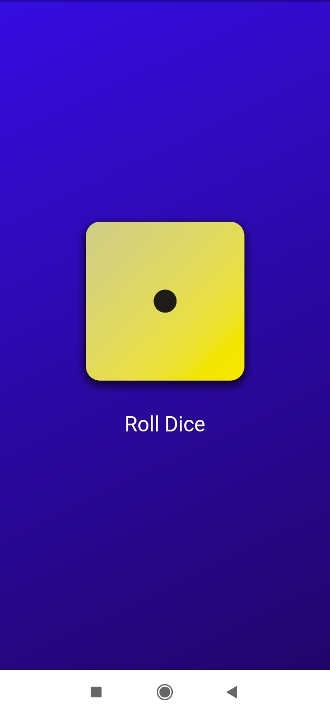

# Dice Roller Flutter App

A simple Flutter application that simulates rolling a dice. When the "Roll Dice" button is clicked, it generates a random number between 1 and 6 and displays the corresponding dice face.

## Features

- Single "Roll Dice" button
- Random dice roll generation
- Visual representation of dice face

## Screenshots

<p >
  
  
</p>


## Getting Started

### Prerequisites

- Flutter SDK: [Install Flutter](https://flutter.dev/docs/get-started/install)
- Dart SDK (included with Flutter)

### Installation

1. Clone the repository:
    ```sh
    git clone https://github.com/aparnaprabhuu/Dice-Roller-App.git
    ```
2. Navigate to the project directory:
    ```sh
    cd Dice-Roller-App
    ```
3. Install dependencies:
    ```sh
    flutter pub get
    ```

### Running the App

1. Ensure a device is connected or an emulator is running.
2. Run the app:
    ```sh
    flutter run
    ```
